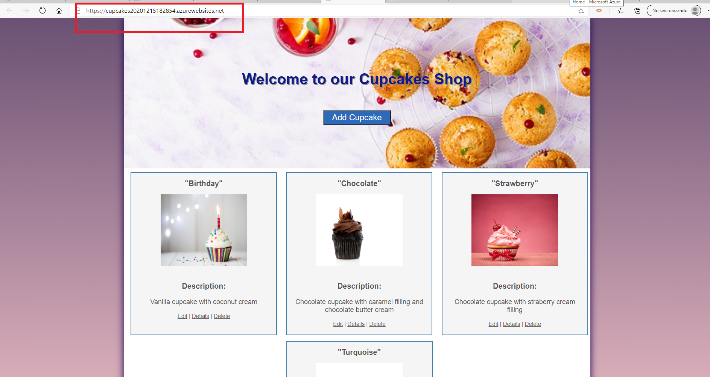

# How-to-Deploy-a-Web-Application-to-Microsoft-Azure

Realizamos el deployment de una aplicación web que previamente hemos desarrollado, en Azure. El resultado final es el que vemos en la imagen siguiente, donde se resalta dirección "azurewebsites.net"

1. **Nombres y apellidos:** Carola Casais Recondo
2. **Fecha:** Miércoles 16 de diciembre de 2020
3. **Resumen del Ejercicio:** El objetivo es desplegar una aplicación web que previamente hemos creado en Azure.
4. **Dificultad o problemas presentados y como se resolvieron:** No hubo dificultades.
